# GoPhishFree – Architecture & UML Diagrams

## Visual Diagrams

### System Architecture

### Risk Scoring Pipeline

### Email Scan Sequence

### Class Diagram

---

## Mermaid Diagrams (Interactive)

*The diagrams below are Mermaid-formatted versions that render interactively on GitHub.*

## High-Level System Architecture

```mermaid
graph TB
    subgraph Chrome Extension
        subgraph "Content Scripts (Gmail Page)"
            CS[content.js<br/>Scanning & Inference Engine]
            FE[featureExtractor.js<br/>FeatureExtractor · DnsChecker · PageAnalyzer]
            CSS[content.css<br/>Badge & Panel Styles]
        end

        subgraph "Background Service Worker"
            BG[background.js<br/>Storage · Messaging · Fetch Proxy]
        end

        subgraph "Popup Dashboard"
            PH[popup.html<br/>Fish Tank Markup & CSS]
            PJ[popup.js<br/>Animation & Data Display]
        end

        subgraph "Static Assets"
            MODEL[model/<br/>model_trees.json<br/>model_deepscan.json]
            ASSETS[Assets/<br/>Logo.png · Banner.png]
            MF[manifest.json]
        end
    end

    subgraph "External Services (Tier 2)"
        CF[Cloudflare DNS-over-HTTPS<br/>cloudflare-dns.com]
        GD[Google DNS-over-HTTPS<br/>dns.google]
    end

    subgraph "External Pages (Tier 3)"
        WEB[Target Webpage<br/>HTML only, no scripts]
    end

    subgraph "Offline Training"
        TP[train_model.py<br/>scikit-learn Random Forest]
        DS[Phishing_Dataset/<br/>Kaggle CSV]
    end

    %% Runtime data flow
    CS -->|"extractEmailFeatures()"| FE
    FE -->|"DNS queries (domains only)"| CF
    FE -.->|"fallback"| GD
    CS -->|"chrome.runtime.sendMessage()"| BG
    BG -->|"chrome.storage.local"| BG
    PJ -->|"chrome.runtime.sendMessage()"| BG
    CS -->|"fetch(model_trees.json)"| MODEL
    BG -->|"fetch(url, credentials:omit)"| WEB

    %% Offline training
    TP -->|"reads"| DS
    TP -->|"exports JSON"| MODEL

    style CS fill:#1a5276,color:#fff
    style FE fill:#1a6e5f,color:#fff
    style BG fill:#6e3a1a,color:#fff
    style PJ fill:#4a1a6e,color:#fff
    style TP fill:#5a5a5a,color:#fff
```

---

## Component Communication Diagram

---

## Class Diagram

---

## Email Scan Sequence Diagram

---

## Deep Scan Sequence Diagram (Tier 3)

---

## Report Phish Sequence Diagram

---

## Risk Scoring Pipeline

```mermaid
flowchart LR
    subgraph "Stage 1: ML Model"
        A[25 Email Features] --> B[Z-Score Normalisation]
        B --> C[200 Decision Trees]
        C --> D["Soft Vote<br/>(avg leaf probability)"]
        D --> E["mlScore = prob × 80"]
    end

    subgraph "Stage 2: Custom Rules"
        F[10 Custom Features] --> G{Tier Classification}
        G -->|"Tier S"| H["Punycode +15<br/>Link Mismatch +14"]
        G -->|"Tier A"| I["Header Mismatch +10<br/>Credentials +5-15<br/>Shortener +8"]
        G -->|"Tier B"| J["Suspicious TLD +5<br/>Urgency +2-6"]
        H --> K[Combination Bonus]
        I --> K
        J --> K
        K -->|"2+ strong"| L["+8"]
        K -->|"3+ strong"| M["+15"]
    end

    subgraph "Stage 3: DNS (Tier 2)"
        N[4 DNS Features] --> O{Tier Classification}
        O -->|"Tier S"| P["No DNS +15"]
        O -->|"Tier A"| Q["Random Domain +10<br/>Unresolved +6"]
        O -->|"Tier B"| R["No MX +5"]
        O -->|"Safety"| S["Multiple IPs -3"]
    end

    E --> T["riskScore = clamp(0, 100,<br/>mlScore + custom + dns)"]
    K --> T
    O --> T

    T --> U{"Score Range"}
    U -->|"0-49"| V["🐟 Friendly Fish<br/>Low Risk"]
    U -->|"50-75"| W["🐠 Suspicious Fish<br/>Medium Risk"]
    U -->|"76-89"| X["🐡 Phishy Puffer<br/>High Risk"]
    U -->|"90-100"| Y["🦈 Mega Phish Shark<br/>Dangerous"]

    style E fill:#1a5276,color:#fff
    style K fill:#1a6e5f,color:#fff
    style O fill:#6e3a1a,color:#fff
    style T fill:#5c1a6e,color:#fff
```

---

## Data Storage Schema

---

## File Dependency Graph

