# GoPhishFree – Architecture & UML Diagrams

## Visual Diagrams

### System Architecture

### Risk Scoring Pipeline

### Email Scan Sequence

### Class Diagram

### ML Model Architecture

### AI Enhancement Flow

---

## Mermaid Diagrams (Interactive)

*The diagrams below are Mermaid-formatted versions that render interactively on GitHub.*

## High-Level System Architecture

---

## Component Communication Diagram

---

## Class Diagram

---

## Email Scan Sequence Diagram (Unified Model + AI Enhancement)

---

## Deep Scan Sequence Diagram (Tier 3)

---

## Report Phish Sequence Diagram

---

## Risk Scoring Pipeline (Unified Calibrated Model)

```mermaid
flowchart LR
    subgraph "Feature Extraction"
        A1[25 URL/Email Features] --> V
        A2[9 Custom Rule Features] --> V
        A3[5 DNS Features<br/>or defaults if not ran] --> V
        A4[13 Deep Scan Features<br/>or defaults if not ran] --> V
        A5[5 BEC/Linkless Features] --> V
        A6[5 Attachment Features] --> V
        A7[2 Context Flags<br/>dns_ran · deep_scan_ran] --> V
        V[buildUnifiedVector<br/>64-element array]
    end

    subgraph "Unified ML Model"
        V --> Z[Z-Score Normalisation]
        Z --> T[200 Decision Trees]
        T --> S["Soft Vote<br/>(avg leaf probability)"]
        S --> C["Isotonic Calibration<br/>(lookup table interpolation)"]
        C --> P["calibratedProb<br/>(0.0 – 1.0)"]
    end

    subgraph "Score Derivation"
        P --> R["riskScore = round(100 × prob)"]
        P --> CONF["confidence = |prob - 0.5| × 2"]
        R --> REASONS["deriveReasons()<br/>informational only"]
    end

    subgraph postModel ["Post-Model Intelligence"]
        R --> PMI{"Post-Model<br/>Adjustments"}
        PMI -->|"BEC/Attach signals"| BOOST["Rule Boosts<br/>Floor 70-80"]
        PMI -->|"Trusted corporate domain"| DAMP["Trusted Dampening<br/>Cap at 30"]
        PMI -->|"Free email provider"| NOFREE["No Dampening<br/>gmail, outlook, etc."]
        PMI -->|"Newsletter detected"| NLTR["Newsletter Cap<br/>Cap at 45"]
        PMI -->|"No special signals"| PASS["Pass through"]
        BOOST --> FINAL["Final Risk Score"]
        DAMP --> FINAL
        NOFREE --> FINAL
        NLTR --> FINAL
        PASS --> FINAL
    end

    R --> U{"Score Range"}
    U -->|"0-49"| F1["🐟 Friendly Fish<br/>Low Risk"]
    U -->|"50-75"| F2["🐠 Suspicious Fish<br/>Medium Risk"]
    U -->|"76-89"| F3["🐡 Phishy Puffer<br/>High Risk"]
    U -->|"90-100"| F4["🦈 Mega Phish Shark<br/>Dangerous"]

    subgraph "Optional: AI Enhancement"
        R --> GATE{"shouldCallAi()?"}
        GATE -->|"Yes"| BUILD["buildAiPayload()<br/>features-only JSON"]
        GATE -->|"No"| SKIP["Skip AI<br/>(high confidence)"]
        BUILD --> APICALL["AI Provider<br/>(BYOK)"]
        APICALL --> VALIDATE["validateAiResponse()"]
        VALIDATE --> DISPLAY["Display AI Score<br/>+ Agreement Badge"]
    end

    style V fill:#1a6e5f,color:#fff
    style C fill:#1a5276,color:#fff
    style R fill:#5c1a6e,color:#fff
    style APICALL fill:#74aa9c,color:#fff
```

---

## AI Enhancement Flow (BYOK)

---

## Data Storage Schema

---

## File Dependency Graph

---

## Unified Feature Schema (64 Features)

| Group | Count | Features |
|-------|-------|----------|
| URL/Email Lexical | 25 | NumDots, SubdomainLevel, PathLevel, UrlLength, NumDash, NumDashInHostname, AtSymbol, NumUnderscore, NumPercent, NumQueryComponents, NumAmpersand, NumHash, NumNumericChars, NoHttps, IpAddress, HostnameLength, PathLength, QueryLength, DoubleSlashInPath, NumLinks, AvgPathEntropy, HasShortenedUrl, NumSensitiveWords, Punycode, LinkMismatchRatio |
| Custom Rules → Model Inputs | 9 | SuspiciousTLD, HeaderMismatch, UrgencyScore, CredentialPhishingScore, SecrecyLanguageScore, HasShortenedUrl, BrandInSubdomain, BrandInPath, MultipleAtSigns |
| DNS | 5 | DomainExists, MXRecordCount, ARecordCount, RandomStringDomain, HasMXRecord |
| Deep Scan Page | 13 | InsecureForms, RelativeFormAction, ExtFormAction, AbnormalFormAction, SubmitInfoToEmail, PctExtHyperlinks, PctExtResourceUrls, ExtFavicon, PctNullSelfRedirectHyperlinks, IframeOrEmbed, MissingTitle, ImagesOnlyInForm, EmbeddedBrandName |
| BEC / Linkless | 5 | FinancialRequestScore, AuthorityImpersonationScore, PhoneCallbackPattern, ReplyToMismatch, IsLinkless |
| Attachment | 5 | HasAttachment, AttachmentCount, RiskyAttachmentExtension, DoubleExtensionFlag, AttachmentNameEntropy |
| Context Flags | 2 | dns_ran, deep_scan_ran |

**Total: 64 features**
