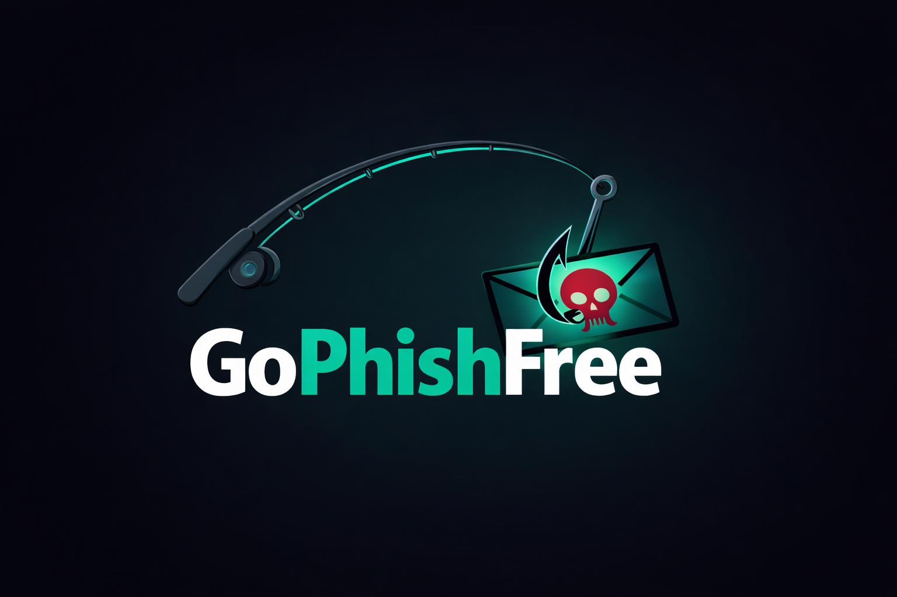

<div align="center">
  
  
  # GoPhishFree
  
  **Protect yourself from phishing emails with AI-powered detection**
  
  *EECS582 Capstone Project*
</div>

---

## Quick Start

**Get started in 3 steps:**

1. **Train the model** (one-time setup)
   ```bash
   pip install pandas scikit-learn numpy joblib
   python train_model.py
   ```

2. **Load in Chrome**
   - Go to `chrome://extensions/`
   - Enable "Developer mode"
   - Click "Load unpacked" -> Select this folder

3. **Open Gmail and start scanning!**

---

## Features

| Feature | Description |
|---------|-------------|
| **Privacy-First** | All processing happens locally - no data leaves your device |
| **Zero Setup** | Install and use immediately - no configuration needed |
| **ML Detection** | Random Forest model with soft-voting inference (200 trees) |
| **3-Tier Scanning** | Email analysis, DNS checks, and optional Deep Scan |
| **Weighted Scoring** | Tiered feature weighting (Smoking Gun / Strong / Soft signals) |
| **Fish Tank UI** | Animated SVG fish tank with collectible phishing-themed fish |
| **Deep Scan** | Optional sandboxed HTML analysis of linked pages (13 extra features) |
| **Manual Reporting** | Report Phish button with severity selection (Low / Medium / High / Dangerous) |
| **Real-Time Alerts** | Instant risk badges on suspicious emails in Gmail |
| **Loading Indicators** | Visual feedback during initial scan and deep scan operations |

---

## How It Works

1. **Open any email in Gmail** - Extension automatically scans it
2. **See risk badge** - Fish-themed badge appears next to email header (e.g., "Friendly Fish (5)")
3. **Click badge** - Opens detailed analysis side panel with risk score, indicators, and suspicious links
4. **Deep Scan (optional)** - Analyze linked page structure for additional phishing signals
5. **Report Phish** - Manually flag suspicious emails with a severity rating
6. **Fish Tank** - Click the extension icon to view your collected fish and scan history

---

## Architecture

### Three-Tier Detection Pipeline

**Tier 1 - Email Analysis (25 ML features + 10 custom features)**
- URL lexical features (dots, dashes, length, subdomains, etc.)
- Domain pattern features (IP addresses, suspicious TLDs, punycode)
- Text analysis (urgency language, credential requests, link mismatches)
- ML model inference via Random Forest with soft-voting probability

**Tier 2 - DNS Checks (4 DNS features, enabled by default)**
- Domain existence validation via DNS-over-HTTPS (Cloudflare / Google)
- MX record checks (sender domain legitimacy)
- Multiple IP detection (load-balanced infrastructure signals)
- Random-string domain detection (Shannon entropy analysis)

**Tier 3 - Deep Scan (13 additional features, user-initiated)**
- Fetches linked page HTML via background service worker (no scripts executed)
- Analyzes form structure (insecure forms, external actions, mailto submissions)
- Checks external resource ratios (hyperlinks, resources, favicons)
- Detects page structure anomalies (iframes, missing titles, brand impersonation)
- Rescores with expanded 38-feature ML model

### Risk Score Calculation

```
Risk Score = (ML Probability x 80) + Custom Adjustment + DNS Adjustment
```

**Weighted Feature Scoring:**
- **Tier S (Smoking Gun):** Punycode (+15), Link Mismatch >30% (+14), Domain doesn't resolve (+15)
- **Tier A (Strong):** Header Mismatch (+10), Credential Requests (up to +15), Random Domain (+10)
- **Tier B (Soft Signal):** Suspicious TLD (+5), Urgency Language (up to +6), No MX Record (+5)
- **Combination Bonus:** 2+ strong signals (+8), 3+ strong signals (+15)

### Risk Classification

| Score Range | Classification | Fish Type |
|-------------|---------------|-----------|
| 0 - 49 | Low Risk | Friendly Fish |
| 50 - 75 | Medium Risk | Suspicious Fish |
| 76 - 89 | High Risk | Phishy Pufferfish |
| 90 - 100 | Dangerous | Mega Phish Shark |

---

## Security

### Privacy Guarantees
- **100% local processing** - No email content is transmitted to any server
- **No API keys required** - Uses free public DNS-over-HTTPS services
- **No backend server** - All ML inference runs in-browser
- **Credentials never sent** - Deep Scan fetches use `credentials: 'omit'`

### Deep Scan Sandboxing
- URL scheme whitelist (http/https only)
- Sender validation (only Gmail content script can trigger)
- Hardcoded permission origins in background service worker
- Response size cap (2 MB), content-type validation
- No script execution - HTML parsed via DOMParser only
- DOM node limit (50,000) to prevent resource exhaustion
- Strict timeout (8 seconds), redirect validation
- `referrerPolicy: 'no-referrer'` to prevent origin leakage

---

## Installation

### Prerequisites
- Python 3.7+ (for model training)
- Google Chrome browser
- Gmail account

### Step-by-Step Setup

**Step 1: Install Dependencies**
```bash
pip install pandas scikit-learn numpy joblib
```

**Step 2: Train Models**
```bash
python train_model.py
```
*Trains two models: Tier 1 Enhanced (25 features) and Deep Scan (38 features). Creates the `model/` directory (~30 seconds).*

**Step 3: Load Extension**
1. Open Chrome -> `chrome://extensions/`
2. Toggle **"Developer mode"** (top right)
3. Click **"Load unpacked"**
4. Select the project folder (containing `manifest.json`)

**Step 4: Start Using!**
- Open Gmail in a new tab
- Click on any email to scan it
- See risk scores instantly!

---

## Usage Guide

### Scanning Emails
- **Automatic**: Open any email in Gmail - scanning happens automatically
- **Risk Badge**: Fish-themed badge appears next to the email subject
- **Details**: Click the badge to open the analysis side panel

### Deep Scan
- Open the analysis side panel by clicking the risk badge
- Click **"Deep Scan Links"** to analyze linked pages
- Confirm the security warning dialog
- View additional findings from page structure analysis

### Report Phish
- In the analysis side panel, click **"Report Phish"**
- Select severity level (Low / Medium / High / Dangerous)
- The email is flagged and a fish is added to your collection

### Fish Tank Dashboard
- Click the **extension icon** (top-right Chrome toolbar)
- View your animated fish tank with collected fish
- See scan statistics (emails scanned, fish caught)
- Browse recent catches and fish collection
- Toggle Enhanced Scanning (DNS checks) on/off

---

## Project Structure

```
GoPhishFree/
├── manifest.json            # Chrome MV3 extension configuration
├── background.js            # Service worker: storage, messaging, fetch proxy
├── content.js               # Gmail content script: scanning, inference, UI
├── content.css              # Side panel and badge styles
├── featureExtractor.js      # Feature extraction classes (URL, DNS, Page)
├── popup.html               # Fish tank dashboard markup and styles
├── popup.js                 # Fish tank animation and dashboard logic
├── train_model.py           # ML model training and JSON export
├── Phishing_Dataset/        # Training data (Kaggle dataset)
│   └── Phishing_Legitimate_full.csv
├── model/                   # Trained models (generated by train_model.py)
│   ├── model_trees.json     # Tier 1 Random Forest (25 features)
│   ├── model_deepscan.json  # Deep Scan Random Forest (38 features)
│   ├── feature_names.json   # Tier 1 feature list
│   ├── feature_names_deepscan.json
│   ├── model.pkl            # Sklearn model artifacts
│   └── scaler.pkl
├── Assets/                  # Visual assets
│   ├── Logo.png             # Extension icon (fishing rod logo)
│   ├── Banner.png           # Header banner image
│   └── Icon.ico             # Favicon
├── plan/                    # Strategy documents
│   └── secure_feature_strategy.md
├── SETUP.md                 # Detailed setup guide
└── README.md                # This file
```

---

## Technical Details

| Component | Technology |
|-----------|-----------|
| Extension Type | Chrome Manifest V3 |
| ML Framework | scikit-learn (Random Forest, 200 estimators) |
| ML Inference | Custom JS tree traversal with soft-voting |
| DNS Resolution | Cloudflare / Google DNS-over-HTTPS |
| Storage | Chrome Storage API (local only) |
| Animations | SVG + CSS keyframes + requestAnimationFrame |
| Privacy | 100% local processing - zero data transmission |

---

## Testing

1. Load the extension in Chrome (see Installation)
2. Open Gmail and click on various emails
3. Verify risk badges appear with appropriate scores
4. Test the analysis side panel (click badge)
5. Try Deep Scan on an email with links
6. Test Report Phish with different severity levels
7. Check the fish tank dashboard (click extension icon)
8. Toggle Enhanced Scanning on/off in settings

---

## License

This project is part of **EECS582 Capstone Project** - for educational purposes.

---

<div align="center">
  <strong>Made with care for safer email</strong>
</div>
